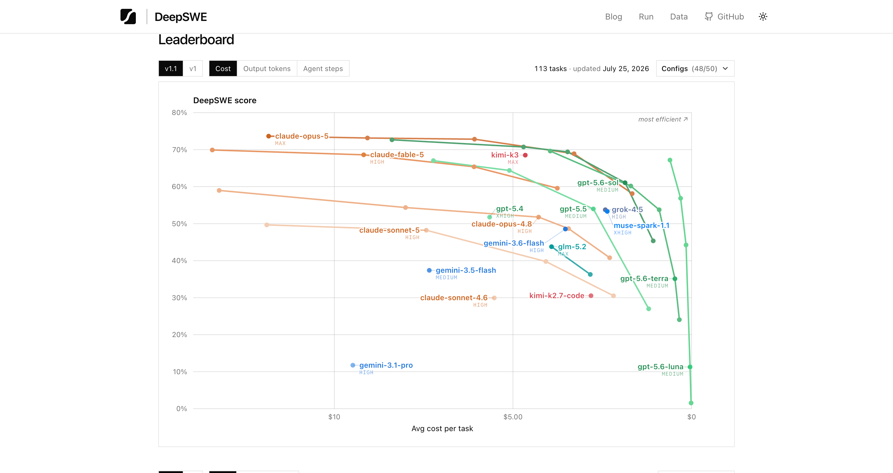
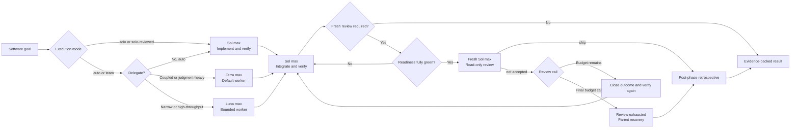

<div align="center">
  
  <h1>Solweaver</h1>
  <p><strong>One Sol lead. Solo or team. Adaptive assurance.</strong></p>
  <p>A practical Codex software workflow where GPT-5.6 Sol can work alone, add a fresh reviewer, or lead GPT-5.6 Terra and Luna as bounded workers.</p>
  <p>
    <a href="https://github.com/jay7793/solweaver/actions/workflows/validate.yml"></a>
    <a href="https://github.com/jay7793/solweaver/releases/latest"></a>
    <a href="./LICENSE"></a>
    
    
  </p>
  <p>
    <a href="#why-solweaver">Why Solweaver</a> ·
    <a href="#quick-start">Quick start</a> ·
    <a href="#usage">Usage</a> ·
    <a href="#how-it-works">How it works</a> ·
    <a href="#benchmark-context">Benchmarks</a> ·
    <a href="#safety-model">Safety</a>
  </p>
</div>

> [!NOTE]
> Solweaver is an open-source community project. It is not an official OpenAI project.

## Why Solweaver

Multi-agent workflows are useful only when ownership stays clear. Solweaver
keeps one agent accountable for the whole outcome, works solo when that is
enough, and routes bounded work only when delegation adds value.

| Sol leads | Terra builds | Luna accelerates |
| --- | --- | --- |
| Plans, implements solo or delegates, integrates, reviews, and delivers | Handles coupled, ambiguous, multi-file, and judgment-heavy implementation | Handles narrow, mechanical, repetitive, and high-throughput assignments |

- **One accountable lead:** Sol remains on the critical path from plan to final
  evidence.
- **Purposeful routing:** auto mode keeps work with Sol when delegation would
  not help; Terra is the default worker, while Luna handles bounded,
  low-coupling work.
- **Safe parallelism:** workers run together only when their ownership is
  explicit and their write scopes are disjoint.
- **Verification built in:** worker summaries are not treated as proof; Sol
  reviews the changes and runs appropriate checks.
- **Adaptive assurance:** ordinary work stays lightweight; auth, money,
  migrations, public APIs, production paths, and wide refactors use one
  final-strict review at the declared final or protected boundary.
- **Runtime honesty:** configured model routing is kept distinct from model and
  effort actually exposed by runtime metadata.
- **No surprise publishing:** deployment, production mutation, commits, pushes,
  and pull requests still require user authorization.

## Benchmark context


These are published **individual-model baselines** from the
[DeepSWE v1.1 leaderboard](https://deepswe.datacurve.ai/). Every model was
evaluated under the same `mini-swe-agent` harness.

> [!IMPORTANT]
> The chart is not a score for `Sol + Terra`, `Sol + Luna`, or Solweaver as a
> team. A valid team benchmark must run each complete configuration on the same
> tasks, limits, environment, and verifiers. Individual scores must not be
> added or averaged into a team result.

<details>
  <summary><strong>View the official DeepSWE leaderboard snapshot</strong></summary>
  <br>
  <a href="https://deepswe.datacurve.ai/">
    
  </a>
  <p><em>DeepSWE v1.1 cost view: 113 tasks, updated July 25, 2026. Screenshot © Datacurve and reproduced here for reference. Click the image for the live leaderboard.</em></p>
</details>

## Quick start

### Requirements

- A Codex runtime and account with access to `gpt-5.6-sol`,
  `gpt-5.6-terra`, and `gpt-5.6-luna`
- Python 3.9 or newer for installation
- Python 3.11 or newer for repository validation

The included configuration uses reasoning effort `max`, prioritizing capability
over token usage.

### 1. Install

```bash
git clone https://github.com/jay7793/solweaver.git
cd solweaver
python3 scripts/install.py
```

The installer copies the user-global skill to `~/.agents/skills/solweaver` and
the agent definitions into `$CODEX_HOME/agents`, or `~/.codex/agents` when
`CODEX_HOME` is unset. It refuses to replace an existing skill or non-identical
agent file unless `--upgrade` is supplied. Upgrade mode creates timestamped
backups before replacement, migrates a legacy `~/.codex/skills/solweaver`
installation so Codex does not discover two copies, and reuses identical shared
agent definitions. Use `--user-skills-dir` only when testing or intentionally
targeting another user-skill root. Custom `--codex-home` and
`--user-skills-dir` targets must be disjoint from the Solweaver source tree and
from each other; the installer rejects any source/write or write/write overlap
before mutation. It resolves every source, destination, legacy, and backup path
through intermediate symlinks before making that comparison or writing. Its
completion message prints an installed-copy validation command with both
selected roots preserved.

Upgrade an existing installation with:

```bash
git pull
python3 scripts/install.py --upgrade
```

### 2. Configure

Merge the relevant settings instead of replacing your existing configuration:

- [`examples/config.toml`](./examples/config.toml) → `~/.codex/config.toml`
- [`examples/AGENTS.md`](./examples/AGENTS.md) → `~/.codex/AGENTS.md`

The example caps spawned-agent concurrency at `2`. The primary Sol thread is
not included in that number, so the maximum visible total is Sol plus two
spawned agents.

Restart Codex or open a new task so the skill, agents, model, and reasoning
settings are reloaded.

### 3. Start a Solweaver task

Invoke the skill explicitly:

```text
$solweaver

Goal: implement the feature and verify it end to end.
```

With the example global policy installed, software-development prompts starting
with `Goal:` or `/goal`, plus requests such as `use software team`, can load
Solweaver automatically.

## Usage

You usually only need to describe the outcome. Sol keeps ownership of the plan,
chooses solo execution or the smallest useful team, reviews the actual changes,
and reports the evidence.

Solweaver is project-neutral: it derives languages, frameworks, commands,
contracts, and evidence conventions from the active workspace instead of
embedding product-specific policy. It can therefore be used from any software
repository where Codex can inspect the project guidance and run the applicable
tools.

For a small ordinary task, invoke Solweaver normally and let `auto` choose local
solo execution with standard assurance. A small task does not create a team,
final-strict ledger, reviewer call, or phase workflow merely because the skill
was invoked.

```text
$solweaver

Goal: fix the validation message typo and run its focused test.
```

### Choose an execution mode

| Mode | Implementation | Independent review |
| --- | --- | --- |
| `auto` (default) | Sol decides between working solo and using the smallest useful team | One target call, with bounded re-review only when final-strict applies |
| `solo` | Sol plans, implements, and verifies alone; no subagents are spawned | None; standard assurance only |
| `solo-reviewed` | Sol implements and verifies alone; no implementation workers are spawned | One target call, with bounded re-review while budget remains |
| `team` | At least one bounded Terra or Luna worker implements under Sol ownership | One target call, with bounded re-review only when final-strict applies |

Invoking Solweaver without a mode uses `auto`; it does not automatically spawn
Terra or Luna.

Keep a small change entirely with Sol:

```text
$solweaver

Use solo mode.

Goal: fix the validation bug and add a focused regression test.
```

Keep implementation with Sol but require an independent final gate:

```text
$solweaver

Use solo-reviewed mode.

Goal: update the authorization boundary and verify the affected behavior.
```

`solo-reviewed` always uses final-strict acceptance. Plain `solo` cannot claim
independent completion because a parent self-review is not independent. If a
solo request triggers final-strict risk, Sol asks whether to continue with
standard assurance or switch to `solo-reviewed`.

### Standard mode

Use standard mode for ordinary feature work:

```text
$solweaver

Goal: add profile editing with validation and regression tests.
```

In the default `auto` execution mode, Sol decides whether delegation adds value,
then inspects and verifies the complete result.

### Final-strict mode

Use final-strict when you want Sol to finish and verify one coherent phase or
delivery unit before using a fresh independent Sol review:

```text
$solweaver

Use team mode with final-strict assurance.

Complete this coherent phase with parent verification after every checkpoint.
Run one fresh final-strict review over the complete integrated assurance unit
at the declared final boundary.
```

Sol derives a stable `ASSURANCE_UNIT_ID` from repository and product authority,
records `REOPEN_GENERATION`, and uses a durable ledger that survives task,
worktree, branch, and candidate changes. The ledger contains the exact base,
cumulative acceptance criteria, checkpoint evidence, review calls, known gaps,
and final boundary. Intermediate results are only `checkpoint-ready`: no final
reviewer is spawned and no `ship` claim is made.

Sol records `FROZEN_CANDIDATE_ID` for the full behavior scope and a separate
`ASSURANCE_PACKET_ID` for the ledger and evidence snapshot. Only the declared
ledger and attempt-coordination sidecar are outside the behavior-candidate
identity; product, test, and contract changes are never omitted. This lets
review accounting advance without silently changing the frozen candidate.
The repository identity reconciles staged, unstaged, and untracked paths;
plain `git diff` is not sufficient when an in-scope file is untracked.
If installed, generated, or runtime-loaded copies are part of the acceptance
boundary, a deterministic `DELIVERY_ARTIFACT_MANIFEST` binds their actual
content into the frozen candidate. Use the bundled
`scripts/compute_delivery_manifest.py` with stable logical labels and retain its
full `solweaver-delivery-v1` records plus the exact command at
`DELIVERY_ARTIFACT_MANIFEST_LOCATION`. A parity check or unexplained aggregate
by itself is evidence, not an immutable identity for those active files.

At the final boundary, Sol freezes the candidate, re-inspects the complete
cumulative diff from the recorded base, resolves product and architecture
decisions, and reruns every applicable parent gate. It then performs a separate
parent adversarial pass with a risk-surface map, counterexamples, negative
paths, changed-to-unchanged interactions, fix-induced regressions, and
test-sensitivity evidence. `missing` or `not_run` evidence blocks review. The
assurance unit must also pass its one-pass reviewability gate and set
`PARENT_ADVERSARIAL_READY: yes`; only then may `REVIEW_READY: yes` permit the
reviewer spawn. This shifts defect discovery before the independent gate.

Final-strict cannot defer review across destructive migration execution, real
money movement, production auth or authorization changes, deployment, merge,
release, or another irreversible external mutation. If that boundary arrives
early, the accumulated relevant change must pass its final gate first. An
assurance unit that is too broad for one complete review must be redefined
before call 1 rather than partially omitted from the reviewer packet.

Final-strict is Solweaver's only independent-review assurance mode. It is
selected automatically for `solo-reviewed` and for auth, authorization,
secrets, tenant isolation, money, data integrity, migrations, destructive
behavior, concurrency, public APIs, production-critical paths, and wide
architectural refactors in `auto` or `team`. It is not compatible with plain
`solo`.

Final-strict may defer the independent review during reversible implementation,
but it still requires a fresh reviewer and `ship` verdict before its final or
protected boundary. A `fix-first` verdict returns findings to the responsible
worker, while `rethink` returns the architecture to Sol.

Each final-strict assurance unit generation targets one reviewer call. The
default hard budget is two. An optional `extended` budget permits at most three
only when the user explicitly authorizes it before call 1; it is never selected
automatically and cannot be enabled or increased after a call is reserved.
Every reviewer spawn that begins execution counts, including a runtime mismatch
or unusable verdict. The counter follows the stable unit across tasks, chats,
continuations, worktrees, branches, spec revisions, and candidate commits.
Renaming or splitting unchanged scope cannot reset it, and extended budget
cannot compensate for an assurance unit that is too broad for one complete
review pass.

Before spawning a reviewer, Sol uses an exclusive durable coordination record
to reserve the next call with a unique `REVIEW_ATTEMPT_ID`. The reservation
occupies the budget before spawn, preventing two tasks from buying the same
call. A Markdown/text journal alone is not a lock: the packet records the exact
atomic lock or compare-and-set primitive, path or key, acquisition, protected
transition, and release. Reservation fails closed unless the same identity and
generation are loaded, `UNIT_STATUS: open`, `REVIEW_READY: yes`, budget remains,
and no reservation is active. It becomes `started` when the child begins and
may be released as `cancelled-before-start` only with exact proof. An
interrupted or ambiguous
reservation is recovered conservatively as consumed. Without an atomic
reservation mechanism, `REVIEW_READY` stays `no`. A lock-busy contender creates
no reservation and consumes no call.
Completion under the same primitive clears the reservation and sets
`UNIT_STATUS: ship` for an accepted `ship`, keeps it `open` only while another
predeclared call remains, or sets `REVIEW_STATUS: review-exhausted` with
`UNIT_STATUS: parent-recovery` after the final non-`ship` call.

Any consumed call without a valid accepted `ship` enters the same re-review
preparation gate when predeclared budget remains. This includes `fix-first`,
`rethink`, an unusable or malformed verdict, and a missing or mismatched runtime
gate. Sol resolves the outcome, refreezes the candidate, reruns parent
adversarial readiness and the full gate, and creates a neutral re-review closure
matrix before the next call, even when no source file changed. The next fresh
reviewer still audits the full cumulative diff, but every blocker must identify
the violated contract, reachable failure or material evidence gap, impact, and
file references. Later-call findings also classify whether they were
pre-existing, introduced by a fix, newly exposed by evidence, or caused by an
acceptance mismatch. Review continues after the first blocker so findings are
not intentionally drip-fed.
If the prior runtime gate was missing or mismatched, configured TOML is not
closure. Exact platform evidence that the intended child's `turn_context` will
be exposed is required before spending another call; otherwise the remaining
call stays unspent.

When a non-`ship` call consumes the last predeclared call, Sol sets
`REVIEW_STATUS: review-exhausted` and `UNIT_STATUS: parent-recovery`, and never
exceeds or raises that maximum.
Parent Sol then owns completion: it reconciles findings, makes conservative
in-scope decisions, applies addressable fixes, refreezes, and verifies the
complete result in the same generation without asking the user merely because
the review budget ended or spawning another reviewer. When all work
and acceptance criteria are complete with no known blocker, report:

```text
WORK_STATUS: complete
ACCEPTANCE_STATUS: met
KNOWN_BLOCKERS: none
INDEPENDENT_ATTESTATION: not-obtained-within-budget
FINAL_STATUS: parent-completed
ASSURANCE_STATUS: final-strict-not-achieved
```

This says the work is complete while accurately withholding reviewer `ship`.
Parent recovery terminates as `UNIT_STATUS: parent-completed`, `blocked`, or
`blocked-external-boundary`; none can reserve another reviewer.

A valid `ship` or a terminal parent-recovery result closes the generation.
Review exhaustion closes only the independent review lane, leaving authorized
parent fixes possible without replenishing calls. Later behavior-changing work
after terminal closure needs an explicitly authorized incremented
`REOPEN_GENERATION`, durable reason, and material new scope; evidence-only
closure does not reopen it. Any `UNIT_STATUS` other than `open` blocks another
reservation even when the old generation has unused numeric budget. After `ship`,
`parent-completed`, `blocked`, or `blocked-external-boundary`, Sol records a
post-phase retrospective with
candidate attempts, exact-evidence reruns, reserved and started reviewer calls,
finding classes, preventable waste, and at most three generalizable improvement
proposals. Workflow changes are proposed for user approval, never applied
automatically.

### Steer worker selection

You do not need to select a worker manually, but you can when the boundary is
clear.

Use Terra for coupled or judgment-heavy implementation:

```text
$solweaver

Use terra_worker for the implementation.

Goal: refactor the authentication service without changing its public API.
```

Use Luna for narrow, repetitive, or low-coupling work:

```text
$solweaver

Delegate the isolated validation fixtures to luna_worker.

Goal: add regression coverage for the request validation helpers.
```

### Run independent work in parallel

State the ownership boundaries when you want parallel workers:

```text
$solweaver

Use the software team. Let Terra own the API implementation and Luna own only
the isolated fixtures. Run them in parallel only if their files do not overlap.

Goal: add CSV export with API tests and fixtures.
```

Parallelism is optional. Shared files, dependency chains, and unresolved design
decisions remain serial.

### Expected result

Sol should finish with:

- the usable outcome and changed-file scope;
- verification commands actually run and their concrete results;
- the execution mode, assurance mode, final-strict base and boundary when
  applicable, stable assurance-unit identity, readiness result, review call
  count, and reviewer verdict;
- the post-phase retrospective status after a terminal final-strict result;
- remaining gaps, risks, or behavior that was not proved; and
- external actions such as commit, push, pull request, merge, or deployment
  still waiting for explicit authorization.

## How it works



| Role | Runtime | Best fit |
| --- | --- | --- |
| Orchestrator and solo implementer | `gpt-5.6-sol` / `max` | Planning, solo implementation, decomposition, ownership, integration, review, and delivery |
| Default worker | `gpt-5.6-terra` / `max` | Coupled, ambiguous, multi-file, architecture-sensitive, backend, frontend, database, integration, debugging, and refactoring work |
| Bounded worker | `gpt-5.6-luna` / `max` | Narrow, mechanical, repetitive, documentation-adjacent, high-throughput, or independent file clusters |
| Final-strict reviewer | `gpt-5.6-sol` / `max`, read-only | One fresh-context review at a declared final or protected boundary; returns `ship`, `fix-first`, or `rethink` |

Sol owns orchestration throughout. Workers receive a concrete goal, explicit
file or module ownership, acceptance criteria, validation commands, and an
expected evidence format. Delegated communication and reports use English by
default; Sol can explicitly request another report language when the workflow
needs it. Code and repository content continue to follow the task and local
conventions. Terra and Luna may run in parallel only when their write scopes
are disjoint.

### Runtime identity gates

After every package-owned child turn, Solweaver inspects
`turn_context.model` and `turn_context.effort`:

| Agent | Required runtime |
| --- | --- |
| `terra_worker` | `gpt-5.6-terra` / `max` |
| `luna_worker` | `gpt-5.6-luna` / `max` |
| `solweaver_reviewer` | `gpt-5.6-sol` / `max` |

Missing or mismatched worker metadata means the lane is not counted as
correctly routed and its report is not evidence. Because native workers share
the worktree, Sol preserves their edits, inspects the complete diff, and
verifies any changes it takes over; it never rolls them back automatically.
Missing or mismatched reviewer metadata rejects the verdict and cannot satisfy
final-strict acceptance.

The gate intentionally checks only those two runtime fields. Agent self-reports,
task labels, and UI names are not proof, and sandbox enforcement is not inferred
from this gate. Optional platform specialists are reported honestly but are not
hard-coded to a model because Solweaver does not own their definitions.

### Assurance modes

| Mode | Use it for | Acceptance |
| --- | --- | --- |
| Standard | Ordinary work in `auto`, `solo`, or `team` execution | Parent inspects the complete diff and reruns proportionate checks |
| Final-strict | One stable phase or delivery unit where intermediate work remains reversible | Durable ledger, parent verification and adversarial readiness, then one target call with a default maximum of two or explicitly predeclared extended maximum of three; only a valid `ship` passes |

Final-strict review is intentionally fresh-context and read-only. The reviewer
never implements its findings. Any call without a valid accepted `ship` returns
to Sol for the same re-review preparation gate while predeclared budget remains:
resolve the finding or failed runtime/packet prerequisite, refreeze the
candidate, rerun parent adversarial readiness and the full gate, and attach a
neutral closure matrix. A non-`ship` final budget call triggers
`review-exhausted`. Sol separates implementation defects, evidence gaps,
fix-induced regressions, unresolved product or architecture decisions, and
acceptance-versus-review expectation mismatches, then owns the fixes and final
verification instead of looping, requesting user direction, switching
workflows, or lowering the review bar.

## What's included

| Path | Purpose |
| --- | --- |
| [`skills/solweaver/`](./skills/solweaver/) | Codex skill and UI metadata |
| [`skills/solweaver/references/runtime-smoke-test.md`](./skills/solweaver/references/runtime-smoke-test.md) | Restarted-task runtime certification procedure |
| [`skills/solweaver/scripts/compute_delivery_manifest.py`](./skills/solweaver/scripts/compute_delivery_manifest.py) | Reproducible versioned manifest for installed delivery artifacts |
| [`skills/solweaver/scripts/validate_install.py`](./skills/solweaver/scripts/validate_install.py) | Installed skill, agent, configuration, and routing validator |
| [`agents/terra-worker.toml`](./agents/terra-worker.toml) | Terra worker definition at `max` |
| [`agents/luna-worker.toml`](./agents/luna-worker.toml) | Luna worker definition at `max` |
| [`agents/solweaver-reviewer.toml`](./agents/solweaver-reviewer.toml) | Fresh read-only Sol reviewer for final-strict gates |
| [`examples/config.toml`](./examples/config.toml) | Parent runtime and concurrency example |
| [`examples/AGENTS.md`](./examples/AGENTS.md) | Minimal global routing policy |
| [`scripts/install.py`](./scripts/install.py) | Dependency-free installer with backup-on-upgrade support |
| [`scripts/validate.py`](./scripts/validate.py) | Standard-library repository validator used by CI |

## Safety model

- The skill cannot change the active parent model by itself.
- Orchestration stays with Sol; a worker cannot silently take over the team.
- Writing agents must preserve unrelated changes and stay inside their assigned
  ownership.
- Native subagents are assumed to share the active worktree unless the host
  explicitly reports isolation.
- A configured model is not described as observed runtime unless runtime or
  session metadata exposes it. Package-owned child results are accepted only
  after their model and effort pass the runtime identity gate.
- Final-strict defers only the independent reviewer. Parent verification still
  runs at every checkpoint, intermediate work cannot claim `ship`, and protected
  irreversible or production boundaries require the final gate first.
- The final-strict review target is one call. The default hard budget is two;
  an explicitly predeclared extended budget is capped at three and cannot be
  enabled after review begins. The durable counter crosses tasks, worktrees,
  branches, and candidates. Exclusive durable reservation prevents concurrent
  tasks from consuming the same call, and candidate identity stays separate
  from mutable attempt accounting. A non-`ship` final budget call hard-stops
  review and cannot be bypassed by raising the cap, renaming, splitting, or
  reopening unchanged scope. It enters non-reviewable `parent-recovery`, where
  Sol may fix and refreeze without replenishing calls, then terminates with
  transparent work and independent-attestation status. Protected external
  actions remain unexecuted without their required authority.
- High-risk auth, money, tenant-isolation, data-integrity, concurrency, and
  production paths stay under parent control and require final-strict review;
  plain `solo` cannot claim final-strict acceptance.
- The skill does not authorize deployment, production mutation, pushing,
  merging, or pull-request creation.

## Validate

Run the same check used by CI:

```bash
python3 scripts/validate.py
```

It validates skill frontmatter, folder and name consistency, UI metadata,
worker TOML definitions, model assignments, reasoning effort, runtime-gate
contracts, the smoke test, and the example configuration. It also executes a
throwaway installer matrix covering fresh installation, overwrite refusal,
backup-on-upgrade, legacy-root migration, installed validation, and exact
source-installed parity.

Validate an installed copy with:

```bash
python3 ~/.agents/skills/solweaver/scripts/validate_install.py
```

Restart Codex or open a new task and follow the bundled runtime smoke test
before describing the workflow as runtime-certified.

## Contributing

Ideas, issues, and focused pull requests are welcome. Please keep routing rules
concise, update examples when behavior changes, and run the validator before
submitting a change.

- [Open an issue](https://github.com/jay7793/solweaver/issues)
- [View the skill source](./skills/solweaver/SKILL.md)

## License

Solweaver is available under the [MIT License](./LICENSE).
