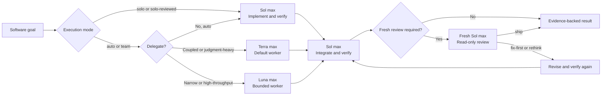

<div align="center">
  
  <h1>Solweaver</h1>
  <p><strong>One Sol lead. Solo or team. Adaptive assurance.</strong></p>
  <p>A practical Codex software workflow where GPT-5.6 Sol can work alone, add a fresh reviewer, or lead GPT-5.6 Terra and Luna as bounded workers.</p>
  <p>
    <a href="https://github.com/jay7793/solweaver/actions/workflows/validate.yml"></a>
    <a href="https://github.com/jay7793/solweaver/releases/latest"></a>
    <a href="./LICENSE"></a>
    
    
  </p>
  <p>
    <a href="#why-solweaver">Why Solweaver</a> ·
    <a href="#quick-start">Quick start</a> ·
    <a href="#usage">Usage</a> ·
    <a href="#how-it-works">How it works</a> ·
    <a href="#benchmark-context">Benchmarks</a> ·
    <a href="#safety-model">Safety</a>
  </p>
</div>

> [!NOTE]
> Solweaver is an open-source community project. It is not an official OpenAI project.

## Why Solweaver

Multi-agent workflows are useful only when ownership stays clear. Solweaver
keeps one agent accountable for the whole outcome, works solo when that is
enough, and routes bounded work only when delegation adds value.

| Sol leads | Terra builds | Luna accelerates |
| --- | --- | --- |
| Plans, implements solo or delegates, integrates, reviews, and delivers | Handles coupled, ambiguous, multi-file, and judgment-heavy implementation | Handles narrow, mechanical, repetitive, and high-throughput assignments |

- **One accountable lead:** Sol remains on the critical path from plan to final
  evidence.
- **Purposeful routing:** auto mode keeps work with Sol when delegation would
  not help; Terra is the default worker, while Luna handles bounded,
  low-coupling work.
- **Safe parallelism:** workers run together only when their ownership is
  explicit and their write scopes are disjoint.
- **Verification built in:** worker summaries are not treated as proof; Sol
  reviews the changes and runs appropriate checks.
- **Adaptive assurance:** ordinary work stays lightweight; auth, money,
  migrations, public APIs, production paths, and wide refactors receive a
  fresh read-only Sol review.
- **Runtime honesty:** configured model routing is kept distinct from model and
  effort actually exposed by runtime metadata.
- **No surprise publishing:** deployment, production mutation, commits, pushes,
  and pull requests still require user authorization.

## Benchmark context


These are published **individual-model baselines** from the
[DeepSWE v1.1 leaderboard](https://deepswe.datacurve.ai/). Every model was
evaluated under the same `mini-swe-agent` harness.

> [!IMPORTANT]
> The chart is not a score for `Sol + Terra`, `Sol + Luna`, or Solweaver as a
> team. A valid team benchmark must run each complete configuration on the same
> tasks, limits, environment, and verifiers. Individual scores must not be
> added or averaged into a team result.

<details>
  <summary><strong>View the official DeepSWE leaderboard snapshot</strong></summary>
  <br>
  <a href="https://deepswe.datacurve.ai/">
    
  </a>
  <p><em>DeepSWE v1.1 cost view: 113 tasks, updated July 25, 2026. Screenshot © Datacurve and reproduced here for reference. Click the image for the live leaderboard.</em></p>
</details>

## Quick start

### Requirements

- A Codex runtime and account with access to `gpt-5.6-sol`,
  `gpt-5.6-terra`, and `gpt-5.6-luna`
- Python 3.9 or newer for installation
- Python 3.11 or newer for repository validation

The included configuration uses reasoning effort `max`, prioritizing capability
over token usage.

### 1. Install

```bash
git clone https://github.com/jay7793/solweaver.git
cd solweaver
python3 scripts/install.py
```

The installer copies the skill and agent definitions into `$CODEX_HOME`, or
`~/.codex` when `CODEX_HOME` is unset. It refuses to overwrite existing files.

### 2. Configure

Merge the relevant settings instead of replacing your existing configuration:

- [`examples/config.toml`](./examples/config.toml) → `~/.codex/config.toml`
- [`examples/AGENTS.md`](./examples/AGENTS.md) → `~/.codex/AGENTS.md`

The example caps spawned-agent concurrency at `2`. The primary Sol thread is
not included in that number, so the maximum visible total is Sol plus two
spawned agents.

Restart Codex or open a new task so the skill, agents, model, and reasoning
settings are reloaded.

### 3. Start a Solweaver task

Invoke the skill explicitly:

```text
$solweaver

Goal: implement the feature and verify it end to end.
```

With the example global policy installed, software-development prompts starting
with `Goal:` or `/goal`, plus requests such as `use software team`, can load
Solweaver automatically.

## Usage

You usually only need to describe the outcome. Sol keeps ownership of the plan,
chooses solo execution or the smallest useful team, reviews the actual changes,
and reports the evidence.

### Choose an execution mode

| Mode | Implementation | Independent review |
| --- | --- | --- |
| `auto` (default) | Sol decides between working solo and using the smallest useful team | Added when strict assurance applies |
| `solo` | Sol plans, implements, and verifies alone; no subagents are spawned | None; standard assurance only |
| `solo-reviewed` | Sol implements and verifies alone; no implementation workers are spawned | One fresh read-only Sol reviewer per verified review round |
| `team` | At least one bounded Terra or Luna worker implements under Sol ownership | Added when strict assurance applies |

Invoking Solweaver without a mode uses `auto`; it does not automatically spawn
Terra or Luna.

Keep a small change entirely with Sol:

```text
$solweaver

Use solo mode.

Goal: fix the validation bug and add a focused regression test.
```

Keep implementation with Sol but require an independent final gate:

```text
$solweaver

Use solo-reviewed mode.

Goal: update the authorization boundary and verify the affected behavior.
```

`solo-reviewed` uses strict acceptance. Plain `solo` cannot claim strict
completion because a parent self-review is not independent. If a solo request
also triggers strict risk, Sol asks whether to continue without strict
acceptance or switch to `solo-reviewed`.

### Standard mode

Use standard mode for ordinary feature work:

```text
$solweaver

Goal: add profile editing with validation and regression tests.
```

In the default `auto` execution mode, Sol decides whether delegation adds value,
then inspects and verifies the complete result.

### Strict mode

Request strict mode explicitly when you want a fresh read-only Sol review:

```text
$solweaver

Use strict mode.

Goal: implement payment webhook verification and replay protection.
```

Solweaver also selects strict mode automatically for auth, authorization,
secrets, tenant isolation, money, data integrity, migrations, destructive
behavior, concurrency, public APIs, production-critical paths, and wide
architectural refactors. Strict completion requires a reviewer verdict of
`ship`; `fix-first` returns findings to the responsible worker, while `rethink`
returns the architecture to Sol. Strict assurance is compatible with `auto`,
`solo-reviewed`, and `team`, but not plain `solo`.

### Steer worker selection

You do not need to select a worker manually, but you can when the boundary is
clear.

Use Terra for coupled or judgment-heavy implementation:

```text
$solweaver

Use terra_worker for the implementation.

Goal: refactor the authentication service without changing its public API.
```

Use Luna for narrow, repetitive, or low-coupling work:

```text
$solweaver

Delegate the isolated validation fixtures to luna_worker.

Goal: add regression coverage for the request validation helpers.
```

### Run independent work in parallel

State the ownership boundaries when you want parallel workers:

```text
$solweaver

Use the software team. Let Terra own the API implementation and Luna own only
the isolated fixtures. Run them in parallel only if their files do not overlap.

Goal: add CSV export with API tests and fixtures.
```

Parallelism is optional. Shared files, dependency chains, and unresolved design
decisions remain serial.

### Expected result

Sol should finish with:

- the usable outcome and changed-file scope;
- verification commands actually run and their concrete results;
- the execution mode, assurance mode, and strict-review verdict when applicable;
- remaining gaps, risks, or behavior that was not proved; and
- external actions such as commit, push, pull request, merge, or deployment
  still waiting for explicit authorization.

## How it works



| Role | Runtime | Best fit |
| --- | --- | --- |
| Orchestrator and solo implementer | `gpt-5.6-sol` / `max` | Planning, solo implementation, decomposition, ownership, integration, review, and delivery |
| Default worker | `gpt-5.6-terra` / `max` | Coupled, ambiguous, multi-file, architecture-sensitive, backend, frontend, database, integration, debugging, and refactoring work |
| Bounded worker | `gpt-5.6-luna` / `max` | Narrow, mechanical, repetitive, documentation-adjacent, high-throughput, or independent file clusters |
| Strict reviewer | `gpt-5.6-sol` / `max`, read-only | Fresh-context review for high-risk or wide changes; returns `ship`, `fix-first`, or `rethink` |

Sol owns orchestration throughout. Workers receive a concrete goal, explicit
file or module ownership, acceptance criteria, validation commands, and an
expected evidence format. Delegated communication and reports use English by
default; Sol can explicitly request another report language when the workflow
needs it. Code and repository content continue to follow the task and local
conventions. Terra and Luna may run in parallel only when their write scopes
are disjoint.

### Assurance modes

| Mode | Use it for | Acceptance |
| --- | --- | --- |
| Standard | Ordinary work in `auto`, `solo`, or `team` execution | Parent inspects the complete diff and reruns proportionate checks |
| Strict | `solo-reviewed`, or auth, authorization, secrets, tenant isolation, money, data integrity, migrations, destructive behavior, concurrency, public APIs, production-critical paths, and wide refactors in `auto` or `team` | Standard verification plus a fresh read-only `solweaver_reviewer` verdict |

Strict review is intentionally fresh-context and read-only. The reviewer never
implements its findings. Any `fix-first` result returns to the responsible
worker, or to Sol in `solo-reviewed`, and requires parent verification plus
another fresh review.

## What's included

| Path | Purpose |
| --- | --- |
| [`skills/solweaver/`](./skills/solweaver/) | Codex skill and UI metadata |
| [`agents/terra-worker.toml`](./agents/terra-worker.toml) | Terra worker definition at `max` |
| [`agents/luna-worker.toml`](./agents/luna-worker.toml) | Luna worker definition at `max` |
| [`agents/solweaver-reviewer.toml`](./agents/solweaver-reviewer.toml) | Fresh read-only Sol reviewer for strict mode |
| [`examples/config.toml`](./examples/config.toml) | Parent runtime and concurrency example |
| [`examples/AGENTS.md`](./examples/AGENTS.md) | Minimal global routing policy |
| [`scripts/install.py`](./scripts/install.py) | Dependency-free, no-overwrite installer |
| [`scripts/validate.py`](./scripts/validate.py) | Standard-library repository validator used by CI |

## Safety model

- The skill cannot change the active parent model by itself.
- Orchestration stays with Sol; a worker cannot silently take over the team.
- Writing agents must preserve unrelated changes and stay inside their assigned
  ownership.
- Native subagents are assumed to share the active worktree unless the host
  explicitly reports isolation.
- A configured model is not described as observed runtime unless runtime or
  spawn metadata exposes it.
- High-risk auth, money, tenant-isolation, data-integrity, concurrency, and
  production paths stay under parent control and require fresh strict review;
  plain `solo` cannot claim strict acceptance.
- The skill does not authorize deployment, production mutation, pushing,
  merging, or pull-request creation.

## Validate

Run the same check used by CI:

```bash
python3 scripts/validate.py
```

It validates skill frontmatter, folder and name consistency, UI metadata,
worker TOML definitions, model assignments, reasoning effort, and the example
configuration.

## Contributing

Ideas, issues, and focused pull requests are welcome. Please keep routing rules
concise, update examples when behavior changes, and run the validator before
submitting a change.

- [Open an issue](https://github.com/jay7793/solweaver/issues)
- [View the skill source](./skills/solweaver/SKILL.md)

## License

Solweaver is available under the [MIT License](./LICENSE).
