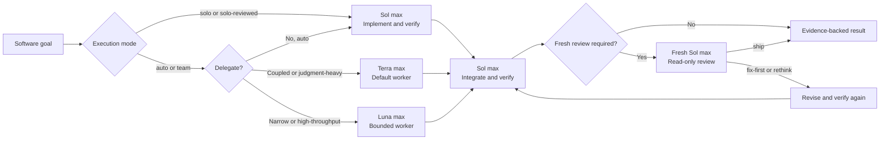

<div align="center">
  
  <h1>Solweaver</h1>
  <p><strong>One Sol lead. Solo or team. Adaptive assurance.</strong></p>
  <p>A practical Codex software workflow where GPT-5.6 Sol can work alone, add a fresh reviewer, or lead GPT-5.6 Terra and Luna as bounded workers.</p>
  <p>
    <a href="https://github.com/jay7793/solweaver/actions/workflows/validate.yml"></a>
    <a href="https://github.com/jay7793/solweaver/releases/latest"></a>
    <a href="./LICENSE"></a>
    
    
  </p>
  <p>
    <a href="#why-solweaver">Why Solweaver</a> ·
    <a href="#quick-start">Quick start</a> ·
    <a href="#usage">Usage</a> ·
    <a href="#how-it-works">How it works</a> ·
    <a href="#benchmark-context">Benchmarks</a> ·
    <a href="#safety-model">Safety</a>
  </p>
</div>

> [!NOTE]
> Solweaver is an open-source community project. It is not an official OpenAI project.

## Why Solweaver

Multi-agent workflows are useful only when ownership stays clear. Solweaver
keeps one agent accountable for the whole outcome, works solo when that is
enough, and routes bounded work only when delegation adds value.

| Sol leads | Terra builds | Luna accelerates |
| --- | --- | --- |
| Plans, implements solo or delegates, integrates, reviews, and delivers | Handles coupled, ambiguous, multi-file, and judgment-heavy implementation | Handles narrow, mechanical, repetitive, and high-throughput assignments |

- **One accountable lead:** Sol remains on the critical path from plan to final
  evidence.
- **Purposeful routing:** auto mode keeps work with Sol when delegation would
  not help; Terra is the default worker, while Luna handles bounded,
  low-coupling work.
- **Safe parallelism:** workers run together only when their ownership is
  explicit and their write scopes are disjoint.
- **Verification built in:** worker summaries are not treated as proof; Sol
  reviews the changes and runs appropriate checks.
- **Adaptive assurance:** ordinary work stays lightweight; auth, money,
  migrations, public APIs, production paths, and wide refactors use one
  final-strict review at the declared final or protected boundary.
- **Runtime honesty:** configured model routing is kept distinct from model and
  effort actually exposed by runtime metadata.
- **No surprise publishing:** deployment, production mutation, commits, pushes,
  and pull requests still require user authorization.

## Benchmark context


These are published **individual-model baselines** from the
[DeepSWE v1.1 leaderboard](https://deepswe.datacurve.ai/). Every model was
evaluated under the same `mini-swe-agent` harness.

> [!IMPORTANT]
> The chart is not a score for `Sol + Terra`, `Sol + Luna`, or Solweaver as a
> team. A valid team benchmark must run each complete configuration on the same
> tasks, limits, environment, and verifiers. Individual scores must not be
> added or averaged into a team result.

<details>
  <summary><strong>View the official DeepSWE leaderboard snapshot</strong></summary>
  <br>
  <a href="https://deepswe.datacurve.ai/">
    
  </a>
  <p><em>DeepSWE v1.1 cost view: 113 tasks, updated July 25, 2026. Screenshot © Datacurve and reproduced here for reference. Click the image for the live leaderboard.</em></p>
</details>

## Quick start

### Requirements

- A Codex runtime and account with access to `gpt-5.6-sol`,
  `gpt-5.6-terra`, and `gpt-5.6-luna`
- Python 3.9 or newer for installation
- Python 3.11 or newer for repository validation

The included configuration uses reasoning effort `max`, prioritizing capability
over token usage.

### 1. Install

```bash
git clone https://github.com/jay7793/solweaver.git
cd solweaver
python3 scripts/install.py
```

The installer copies the skill and agent definitions into `$CODEX_HOME`, or
`~/.codex` when `CODEX_HOME` is unset. It refuses to replace an existing skill
or non-identical agent file unless `--upgrade` is supplied. Upgrade mode creates
timestamped backups before replacing them and reuses identical shared agent
definitions.

Upgrade an existing installation with:

```bash
git pull
python3 scripts/install.py --upgrade
```

### 2. Configure

Merge the relevant settings instead of replacing your existing configuration:

- [`examples/config.toml`](./examples/config.toml) → `~/.codex/config.toml`
- [`examples/AGENTS.md`](./examples/AGENTS.md) → `~/.codex/AGENTS.md`

The example caps spawned-agent concurrency at `2`. The primary Sol thread is
not included in that number, so the maximum visible total is Sol plus two
spawned agents.

Restart Codex or open a new task so the skill, agents, model, and reasoning
settings are reloaded.

### 3. Start a Solweaver task

Invoke the skill explicitly:

```text
$solweaver

Goal: implement the feature and verify it end to end.
```

With the example global policy installed, software-development prompts starting
with `Goal:` or `/goal`, plus requests such as `use software team`, can load
Solweaver automatically.

## Usage

You usually only need to describe the outcome. Sol keeps ownership of the plan,
chooses solo execution or the smallest useful team, reviews the actual changes,
and reports the evidence.

### Choose an execution mode

| Mode | Implementation | Independent review |
| --- | --- | --- |
| `auto` (default) | Sol decides between working solo and using the smallest useful team | One final review when final-strict assurance applies |
| `solo` | Sol plans, implements, and verifies alone; no subagents are spawned | None; standard assurance only |
| `solo-reviewed` | Sol implements and verifies alone; no implementation workers are spawned | Always one final-strict gate, plus a fresh re-review after fixes |
| `team` | At least one bounded Terra or Luna worker implements under Sol ownership | One final review when final-strict assurance applies |

Invoking Solweaver without a mode uses `auto`; it does not automatically spawn
Terra or Luna.

Keep a small change entirely with Sol:

```text
$solweaver

Use solo mode.

Goal: fix the validation bug and add a focused regression test.
```

Keep implementation with Sol but require an independent final gate:

```text
$solweaver

Use solo-reviewed mode.

Goal: update the authorization boundary and verify the affected behavior.
```

`solo-reviewed` always uses final-strict acceptance. Plain `solo` cannot claim
independent completion because a parent self-review is not independent. If a
solo request triggers final-strict risk, Sol asks whether to continue with
standard assurance or switch to `solo-reviewed`.

### Standard mode

Use standard mode for ordinary feature work:

```text
$solweaver

Goal: add profile editing with validation and regression tests.
```

In the default `auto` execution mode, Sol decides whether delegation adds value,
then inspects and verifies the complete result.

### Final-strict mode

Use final-strict when you want Sol to finish and verify one coherent phase or
batch before paying for a fresh independent Sol review:

```text
$solweaver

Use team mode with final-strict assurance.

Complete this coherent phase with parent verification after every checkpoint.
Run one fresh final-strict review over the complete integrated batch at the
declared final boundary.
```

Sol records the exact base state, cumulative acceptance criteria, checkpoint
evidence, known gaps, and the final boundary. Intermediate results are only
`checkpoint-ready`: no final reviewer is spawned and no `ship` claim is made.
At the final boundary, Sol re-inspects the complete cumulative diff from the
recorded base, reruns integration or acceptance checks, and sends the whole
batch to one fresh runtime-verified reviewer.

Final-strict cannot defer review across destructive migration execution, real
money movement, production auth or authorization changes, deployment, merge,
release, or another irreversible external mutation. If that boundary arrives
early, the accumulated relevant change must pass its final gate first. A batch
that becomes too broad for one complete review must be split rather than
partially omitted from the reviewer packet.

Final-strict is Solweaver's only independent-review assurance mode. It is
selected automatically for `solo-reviewed` and for auth, authorization,
secrets, tenant isolation, money, data integrity, migrations, destructive
behavior, concurrency, public APIs, production-critical paths, and wide
architectural refactors in `auto` or `team`. It is not compatible with plain
`solo`.

Final-strict may defer the independent review during reversible implementation,
but it still requires a fresh reviewer and `ship` verdict before its final or
protected boundary. A `fix-first` verdict returns findings to the responsible
worker, while `rethink` returns the architecture to Sol.

Each final-strict batch has a hard budget of two reviewer calls. Every reviewer
spawn that begins execution counts, including a runtime mismatch or unusable
verdict. If call 2 does not return a valid `ship`, Sol sets
`REVIEW_STATUS: review-exhausted` and never starts call 3 for the same batch.
Parent Sol then owns completion: it reconciles findings, makes conservative
in-scope decisions, applies addressable fixes, and verifies the complete result
without asking the user merely because the review budget ended. A completed
result is reported as `FINAL_STATUS: parent-completed` and
`ASSURANCE_STATUS: final-strict-not-achieved`, not reviewer `ship`.

### Steer worker selection

You do not need to select a worker manually, but you can when the boundary is
clear.

Use Terra for coupled or judgment-heavy implementation:

```text
$solweaver

Use terra_worker for the implementation.

Goal: refactor the authentication service without changing its public API.
```

Use Luna for narrow, repetitive, or low-coupling work:

```text
$solweaver

Delegate the isolated validation fixtures to luna_worker.

Goal: add regression coverage for the request validation helpers.
```

### Run independent work in parallel

State the ownership boundaries when you want parallel workers:

```text
$solweaver

Use the software team. Let Terra own the API implementation and Luna own only
the isolated fixtures. Run them in parallel only if their files do not overlap.

Goal: add CSV export with API tests and fixtures.
```

Parallelism is optional. Shared files, dependency chains, and unresolved design
decisions remain serial.

### Expected result

Sol should finish with:

- the usable outcome and changed-file scope;
- verification commands actually run and their concrete results;
- the execution mode, assurance mode, final-strict base and boundary when
  applicable, and reviewer verdict;
- remaining gaps, risks, or behavior that was not proved; and
- external actions such as commit, push, pull request, merge, or deployment
  still waiting for explicit authorization.

## How it works



| Role | Runtime | Best fit |
| --- | --- | --- |
| Orchestrator and solo implementer | `gpt-5.6-sol` / `max` | Planning, solo implementation, decomposition, ownership, integration, review, and delivery |
| Default worker | `gpt-5.6-terra` / `max` | Coupled, ambiguous, multi-file, architecture-sensitive, backend, frontend, database, integration, debugging, and refactoring work |
| Bounded worker | `gpt-5.6-luna` / `max` | Narrow, mechanical, repetitive, documentation-adjacent, high-throughput, or independent file clusters |
| Final-strict reviewer | `gpt-5.6-sol` / `max`, read-only | One fresh-context review at a declared final or protected boundary; returns `ship`, `fix-first`, or `rethink` |

Sol owns orchestration throughout. Workers receive a concrete goal, explicit
file or module ownership, acceptance criteria, validation commands, and an
expected evidence format. Delegated communication and reports use English by
default; Sol can explicitly request another report language when the workflow
needs it. Code and repository content continue to follow the task and local
conventions. Terra and Luna may run in parallel only when their write scopes
are disjoint.

### Runtime identity gates

After every package-owned child turn, Solweaver inspects
`turn_context.model` and `turn_context.effort`:

| Agent | Required runtime |
| --- | --- |
| `terra_worker` | `gpt-5.6-terra` / `max` |
| `luna_worker` | `gpt-5.6-luna` / `max` |
| `solweaver_reviewer` | `gpt-5.6-sol` / `max` |

Missing or mismatched worker metadata means the lane is not counted as
correctly routed and its report is not evidence. Because native workers share
the worktree, Sol preserves their edits, inspects the complete diff, and
verifies any changes it takes over; it never rolls them back automatically.
Missing or mismatched reviewer metadata rejects the verdict and cannot satisfy
final-strict acceptance.

The gate intentionally checks only those two runtime fields. Agent self-reports,
task labels, and UI names are not proof, and sandbox enforcement is not inferred
from this gate. Optional platform specialists are reported honestly but are not
hard-coded to a model because Solweaver does not own their definitions.

### Assurance modes

| Mode | Use it for | Acceptance |
| --- | --- | --- |
| Standard | Ordinary work in `auto`, `solo`, or `team` execution | Parent inspects the complete diff and reruns proportionate checks |
| Final-strict | One coherent phase or batch where intermediate work remains reversible | Parent verification at every checkpoint, then at most two fresh review calls; only a valid `ship` passes |

Final-strict review is intentionally fresh-context and read-only. The reviewer
never implements its findings. A first-call `fix-first` result returns to the
responsible worker, or to Sol in `solo-reviewed`, and requires parent
verification plus a closure matrix before the second and final review. A
non-`ship` second call triggers `review-exhausted`. Sol separates implementation
defects, evidence gaps, unresolved product or architecture decisions, and
acceptance-versus-review expectation mismatches, then owns the fixes and final
verification instead of looping, requesting user direction, switching
workflows, or lowering the review bar.

## What's included

| Path | Purpose |
| --- | --- |
| [`skills/solweaver/`](./skills/solweaver/) | Codex skill and UI metadata |
| [`skills/solweaver/references/runtime-smoke-test.md`](./skills/solweaver/references/runtime-smoke-test.md) | Restarted-task runtime certification procedure |
| [`skills/solweaver/scripts/validate_install.py`](./skills/solweaver/scripts/validate_install.py) | Installed skill, agent, configuration, and routing validator |
| [`agents/terra-worker.toml`](./agents/terra-worker.toml) | Terra worker definition at `max` |
| [`agents/luna-worker.toml`](./agents/luna-worker.toml) | Luna worker definition at `max` |
| [`agents/solweaver-reviewer.toml`](./agents/solweaver-reviewer.toml) | Fresh read-only Sol reviewer for final-strict gates |
| [`examples/config.toml`](./examples/config.toml) | Parent runtime and concurrency example |
| [`examples/AGENTS.md`](./examples/AGENTS.md) | Minimal global routing policy |
| [`scripts/install.py`](./scripts/install.py) | Dependency-free installer with backup-on-upgrade support |
| [`scripts/validate.py`](./scripts/validate.py) | Standard-library repository validator used by CI |

## Safety model

- The skill cannot change the active parent model by itself.
- Orchestration stays with Sol; a worker cannot silently take over the team.
- Writing agents must preserve unrelated changes and stay inside their assigned
  ownership.
- Native subagents are assumed to share the active worktree unless the host
  explicitly reports isolation.
- A configured model is not described as observed runtime unless runtime or
  session metadata exposes it. Package-owned child results are accepted only
  after their model and effort pass the runtime identity gate.
- Final-strict defers only the independent reviewer. Parent verification still
  runs at every checkpoint, intermediate work cannot claim `ship`, and protected
  irreversible or production boundaries require the final gate first.
- The final-strict review budget is two calls per batch. A non-`ship` second
  call hard-stops review and cannot be bypassed by resetting the same batch.
  Parent Sol continues with transparent `parent-completed` recovery; protected
  external actions remain unexecuted without their required authority.
- High-risk auth, money, tenant-isolation, data-integrity, concurrency, and
  production paths stay under parent control and require final-strict review;
  plain `solo` cannot claim final-strict acceptance.
- The skill does not authorize deployment, production mutation, pushing,
  merging, or pull-request creation.

## Validate

Run the same check used by CI:

```bash
python3 scripts/validate.py
```

It validates skill frontmatter, folder and name consistency, UI metadata,
worker TOML definitions, model assignments, reasoning effort, runtime-gate
contracts, the smoke test, installer behavior, and the example configuration.

Validate an installed copy with:

```bash
python3 ~/.codex/skills/solweaver/scripts/validate_install.py
```

Restart Codex or open a new task and follow the bundled runtime smoke test
before describing the workflow as runtime-certified.

## Contributing

Ideas, issues, and focused pull requests are welcome. Please keep routing rules
concise, update examples when behavior changes, and run the validator before
submitting a change.

- [Open an issue](https://github.com/jay7793/solweaver/issues)
- [View the skill source](./skills/solweaver/SKILL.md)

## License

Solweaver is available under the [MIT License](./LICENSE).
